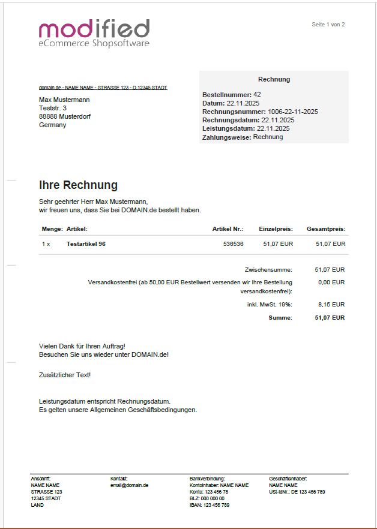
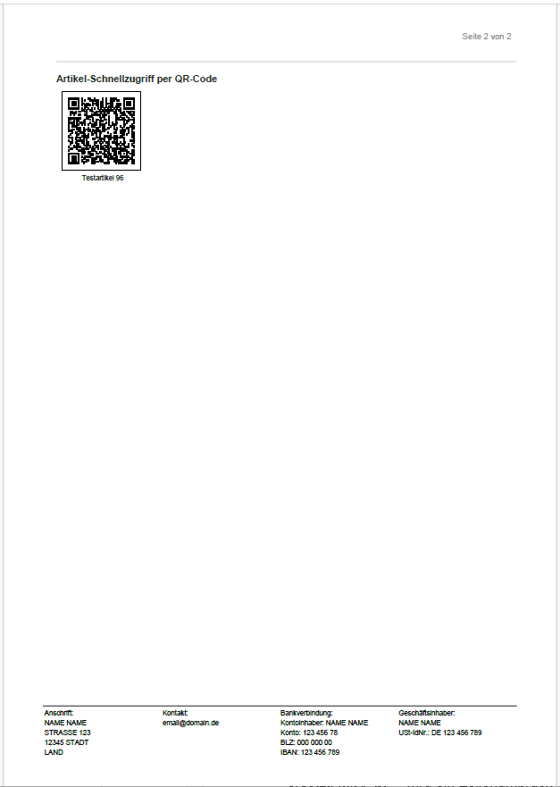

# PDF Rechnung

**Ein Systemmodul für die *mod*ified eCommerce Shopsoftware**

Mit dieser Erweiterung können Rechnungen und Lieferscheine im PDF-Format erstellt und per Mail versandt werden.

Als Generator wird die PHP Bibliothek „**html2pdf**“ (<a href="https://github.com/spipu/html2pdf">spipu/html2pdf</a>) genutzt.

Html2Pdf ist ein HTML zu PDF Konverter, spezielle Tags sind hinzugefügt worden um HTML mit PDF kompatibel zu machen.

Für den PDF Bereich wird „**TCPDF**“ genutzt.

 

> [!TIP]
> Hinweis: Das Modul ist vorbereitet für die Anbindung an das Systemmodul "*E-Rechnungen für modified eCommerce Shopsoftware*" von AGI.
> Das Paket "agi_factur_x..." kann bei Modified heruntergeladen werden.
> Sobald "E-Rechnung" installiert und aktiviert ist wird der PDF-Datei die E-Rechnung beigefügt.

 
<a href="https://raw.githubusercontent.com/KarlBogen/manuals/master/pdfinvoice/handbuch.pdf">Das Handbuch im PDF-Format kann hier heruntergeladen werden.</a>
 
 
 

**Das Modul benötigt *mod*ified eCommerce Shopsoftware Version 3.0.0 oder höher**

Getestet wurde das Modul mit den stable Versionen "3.1.6".
